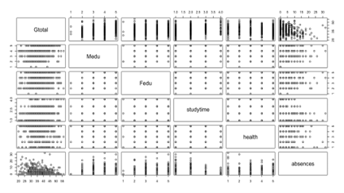

# Predicting Student Performance in Portuguese Secondary Schools
This research project report has been submitted as an assignment for course **231A-STATS-101A Introduction to Data Analysis and Regression** in UCLA. This version has been adjusted for Github Repository for a better performance. 

> [!WARNING]
> Plagiarithm is an academic offence taken very seriously in UCLA and NUS, please refer to the Code of Student Conduct.

# 1 Introduction
In recent years, predicting student performance has become increasingly important for both educators and policymakers. In this project, we seek to determine the most influential predictors on a student's final grade in Portuguese secondary schools using a combination of students’ physical and school-related factors.

## 1.1 Research Question of Interest
Our research question is: Can we accurately predict students' final grades based on their time of study, family members’ education level, students’ health condition and number of absences? This question was formulated considering its potential implications for early interventions in a student's academic journey. For instance, understanding what non-academic factors contribute significantly to final grades could help schools and policymakers design effective support systems to improve student performance.

## 1.2 Background and Source of the Data Set
The data we use in this project was collected from two Portuguese secondary schools and includes a variety of student grades, family-related and school-related attributes. In this report, we start by providing a descriptive analysis of the data, then move on to fit and interpret multiple regression models to answer our research question, and finally discuss our findings and their implications. The variables include:

| Field      | Description            | Options                             |
|------------|------------------------|-------------------------------------|
| Medu       | Mother's Education     | 1 - None, 2 - Primary, 3 - Secondary, 4 - College |
| Fedu       | Father's Education     | 1 - None, 2 - Primary, 3 - Secondary, 4 - College |
| studytime  | Weekly Study Time      | 1 - <2 hours, 2 - 2 to 5 hours, 3 - 5 to 10 hours, 4 - >10 hours |
| health     | Current Health Status  | 1 - Very Bad, 2, 3, 4, 5 - Very Good |
| absences   | Number of Absences     | 0 to 93                             |
| G1         | First-Period Grade     | 0 to 20                             |
| G2         | Second-Period Grade    | 0 to 20                             |
| G3         | Final Grade            | 0 to 20                             |
| Gtotal     | Total Grade            | 0 to 60                             |

> [!TIP]
> The latest version of this project report, datasets and R source code files are available in this GitHub repository.

# 1.3 Explain the method chosen to model the relationship
While modeling the relationship between different variables, we begin with the Multiple Linear Regression (MLR) and diagnostic plots. To better the model, we use transformation and model selection for MLR. After getting the final model, we check the improvements by viewing the general diagnostic plots. 

# 1.4 Overview of the structure of our research
We begin the paper with scatter plots for the data to show the general relationship between the response variable (Gtotal) and all predictors. Then we use the R results to comment on the fit of the linear model and find a better model for the data set. Finally, we summarize the results by discussing the limitations and expectations of our model.

# 2 Data Description
The Figure 2.1 shows the correlations relationship between each variable. 


The summary statistics of these variables such as mean, standard deviation, distribution of each variable and relationships among the variables using appropriate graphs are attached in Appendix II.

# 3 Results and Interpretation
## 3.1 Original Model Diagnostics

Based on the scatter plot (Figure 2.1) and summary result (Tab 3.1), we learn about the relationship between response variable and all predictors. We can learn from scatter plot and summary result that except for the educational levels of fathers, all other variables are statistically significant.

**Tab 3.1** Summary Result of Original Model
```
Call:
lm(formula = Gtotal ~ Medu + Fedu + studytime + health + absences, 
    data = student)

Residuals:
     Min       1Q   Median       3Q      Max 
-18.5097  -4.4600  -0.2166   4.0884  17.7181 

Coefficients:
            Estimate Std. Error t value Pr(>|t|)    
(Intercept) 31.09306    1.73540  17.917  < 2e-16 ***
Medu         1.21202    0.38351   3.160 0.001691 **
Call:
lm(formula = Gtotal ~ Medu + Fedu + studytime + health + absences, 
    data = student)

Residuals:
     Min       1Q   Median       3Q      Max 
-18.5097  -4.4600  -0.2166   4.0884  17.7181 

Coefficients:
            Estimate Std. Error t value Pr(>|t|)    
(Intercept) 31.09306    1.73540  17.917  < 2e-16 ***
Medu         1.21202    0.38351   3.160 0.001691 ** 
Fedu         0.25086    0.37613   0.667 0.505165    
studytime    1.82387    0.38853   4.694 3.64e-06 ***
health      -0.67388    0.22628  -2.978 0.003070 ** 
absences    -0.24260    0.06267  -3.871 0.000126 ***
Signif. codes:  0 ‘***’ 0.001 ‘**’ 0.01 ‘*’ 0.05 ‘.’ 0.1 ‘ ’ 1
Residual standard error: 6.564 on 417 degrees of freedom
Multiple R-squared:  0.1634,	Adjusted R-squared:  0.1534 
F-statistic: 16.29 on 5 and 417 DF,  p-value: 1.089e-14
```

Based on the diagnostic plots (see Appendix I, Figure I.1), we know that the variance of residuals is not constant and there are some bad leverage points. Thus, this model is not valid and needs to be modified. Then we use the R code result (Table 3.2) to determine the transformation needed for each variable. Since for the variable of absence, there are 0 values that hinder our function, we add 1 to all absence values.

**Tab 3.2** Transformation Results for each variable
```
bcPower Transformations to Multinormality 
          Est Power Rounded Pwr Wald Lwr Bnd Wald Upr Bnd
Gtotal       0.6166        1.00       0.2193       1.0140
Medu         1.2951        1.00       0.9946       1.5956
Fedu         0.7896        1.00       0.5172       1.0619
studytime    0.1993        0.00      -0.0206       0.4192
health       1.4179        1.42       1.1839       1.6518
            -0.0531        0.00      -0.1634       0.0572
Likelihood ratio test that transformation parameters are equal to 0
 (all log transformations)
                                    LRT df       pval
LR test, lambda = (0 0 0 0 0 0) 304.811  6 < 2.22e-16

Likelihood ratio test that no transformations are needed
                                     LRT df       pval
LR test, lambda = (1 1 1 1 1 1) 468.6497  6 < 2.22e-16
```
Based on the rounded power in R result, we can get the transformed model to be: $`Gtotal = β_0+ β_1× Medu + β_2× Fedu + β_3×log⁡(studytime)+ β_4× health^{1.42}+ β_5×log⁡(absences +1)`$

**Tab 3.3** Summary Result of Transformed Model
```
Call:
lm(formula = Gtotal ~ Medu + Fedu + log(studytime) + I(health^(1.4)) + 
    log(absences + 1), data = student)
Residuals:
     Min       1Q   Median       3Q      Max 
-18.8946  -4.3599  -0.0842   4.2985  17.9949 
Coefficients:
                  Estimate Std. Error t value Pr(>|t|)    
(Intercept)        32.2162     1.5458  20.842  < 2e-16 ***
Medu                1.2536     0.3830   3.273  0.00115 ** 
Fedu                0.2263     0.3760   0.602  0.54754    
log(studytime)      3.6824     0.7561   4.870 1.59e-06 ***
I(health^(1.4))    -0.2907     0.1030  -2.822  0.00501 ** 
log(absences + 1)  -1.1697     0.3278  -3.569  0.00040 ***
---
Signif. codes:  0 ‘***’ 0.001 ‘**’ 0.01 ‘*’ 0.05 ‘.’ 0.1 ‘ ’ 1
Residual standard error: 6.565 on 417 degrees of freedom
Multiple R-squared:  0.1631,	Adjusted R-squared:  0.153 
F-statistic: 16.25 on 5 and 417 DF,  p-value: 1.189e-14
```

## 3.2 Final Model Diagnostics
After figuring out the variable transformation, we should then move on to the variable selection process. We can use the forward stepwise method to find out the best subset model.

**Tab 3.4** Result of Forward Stepwise Method
```
Start:  AIC=1663.25
Gtotal ~ 1

                    Df Sum of Sq   RSS    AIC
+ log(studytime)     1   1608.67 19867 1632.3
+ Medu               1   1153.63 20322 1641.9
+ log(absences + 1)  1    942.13 20534 1646.3
+ I(health^(1.4))    1    476.34 20999 1655.8
+ Fedu               1    446.32 21029 1656.4
<none>                           21476 1663.2

Step:  AIC=1632.31
Gtotal ~ log(studytime)
                    Df Sum of Sq   RSS    AIC
+ Medu               1   1022.92 18844 1612.0
+ log(absences + 1)  1    576.25 19291 1621.9
+ Fedu               1    468.35 19399 1624.2
+ I(health^(1.4))    1    321.10 19546 1627.4
<none>                           19867 1632.3

Step:  AIC=1611.95
Gtotal ~ log(studytime) + Medu

                    Df Sum of Sq   RSS    AIC
+ log(absences + 1)  1    518.66 18325 1602.2
+ I(health^(1.4))    1    312.59 18532 1606.9
<none>                           18844 1612.0
+ Fedu               1      3.80 18840 1613.9

Step:  AIC=1602.15
Gtotal ~ log(studytime) + Medu + log(absences + 1)
                  Df Sum of Sq   RSS    AIC
+ I(health^(1.4))  1    335.94 17990 1596.3
<none>                         18325 1602.2
+ Fedu             1      8.38 18317 1604.0

Step:  AIC=1596.32
Gtotal ~ log(studytime) + Medu + log(absences + 1) + I(health^(1.4))

       Df Sum of Sq   RSS    AIC
<none>              17990 1596.3
+ Fedu  1    15.618 17974 1598.0
```

Based on the AIC values, we know that when the model is $`Gtotal ~ log(studytime) + Medu + log(absences + 1) + I(health^1.4)`$, AIC get the smallest value. Therefore, the final model should be: $`Gtotal = β_0  + β_1  × Medu + β_2×log(studytime) + β_3  × health^1.42  + β_4  × log(absences +1) `$. Checking on this final model, we can get the summary and diagnostic plots (see Appendix I, Figure I.2).

**Tab 3.5** Summary Result of Final Model
```
Call:
x

Residuals:
     Min       1Q   Median       3Q      Max 
-18.7267  -4.3258  -0.1429   4.2414  17.6855 

Coefficients:
                  Estimate Std. Error t value Pr(>|t|)    
(Intercept)        32.4402     1.4991  21.639  < 2e-16 ***
Medu                1.3991     0.2969   4.712 3.35e-06 ***
log(studytime)      3.6628     0.7548   4.852 1.72e-06 ***
I(health^(1.4))    -0.2871     0.1028  -2.794 0.005447 ** 
log(absences + 1)  -1.1612     0.3272  -3.549 0.000431 ***
---
Signif. codes:  0 ‘***’ 0.001 ‘**’ 0.01 ‘*’ 0.05 ‘.’ 0.1 ‘ ’ 1
Residual standard error: 6.56 on 418 degrees of freedom
Multiple R-squared:  0.1623,	Adjusted R-squared:  0.1543 
F-statistic: 20.25 on 4 and 418 DF,  p-value: 2.918e-15
```

Based on the plots and summary, we know that all transformed variables in the final model are significant. Also, the variance of residuals becomes more constant, and the model has less bad leverage points. 

# 4 Summary and Further Analysis
In order to get the final model about the relationship between students' academic performance, which is shown as the final grades in our project, and the time of study, family members’ education levels, students’ health conditions and number of absences, we use multiple linear regression model and the proper transformation and selection methods to find out the best model for our data set.

Based on our model, we find out that the students’ final grades are highly related to all transformed variables except the educational level of fathers. Therefore, we know that the educational levels of fathers have no relationship with students’ final grades. For the educational levels of mothers, the slope coefficient is 1.3991, which means that as mothers have higher education levels, students generally have higher final grades. Similarly, the study time also has a positive association with final grades, which indicates that as students study more, they get a better grade. However, the transformed variable of absence has a significant negative relationship with the total grades, so as students have more times of absences, they get a lower grade. The transformed variable of health also has a negative relationship with total grades, but the coefficient is not large enough. In this case, we can assume that when students have better health conditions, they perform worse academically, but this actually has little impact on the academic performance. We think our model makes sense in real life. Fathers hardly ever pay attention to their kids' study so the fathers' educational level has no relationship with students' academic scores. However, mothers devote most of their time to kids, so their educational levels will greatly affect how they treated their kids' study. Therefore, as mothers have higher educational levels, like college, they pay more attention and more money for kids' study, which greatly improves their academic performance. It’s obvious that absences will negatively influence students' final scores because they miss some key points while they are away from class. Poorer health conditions may be related with higher graders because unhealthy kids have more time staying at home and learning things.

Despite all the achievements we have made, our project has some drawbacks. We want to study how different variables affect students' final grades and academic performance. However, we only get the data from two Portuguese secondary schools which means we cannot apply this model to all secondary schools students. If some elements are different, like the size of the school or even the place where the school is located, the result may be very different. Therefore, in order to improve the model, we should collect students' data from secondary schools of different sizes and at different places.  
